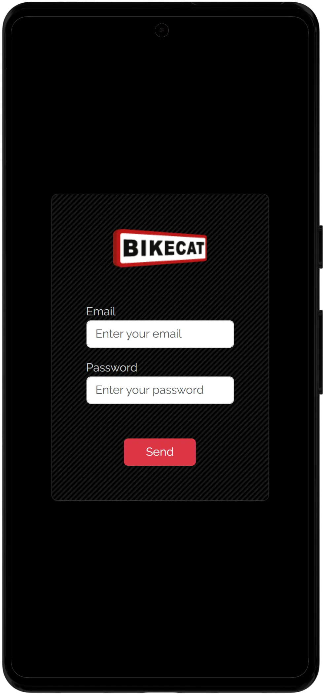
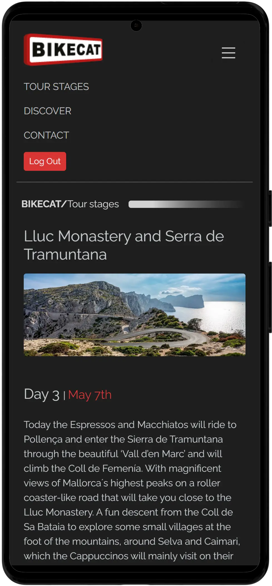

# 🚴 Bikecat — Cycling Tours Management Platform

A full-stack web application to manage and visualize **cycling tours**, including  
days (stages), routes, hotels, locations and discover points.

Built with:

-  Angular (frontend)
-  Node + Express (backend)
-  MySQL + Sequelize (ORM)

Bikecat allows administrators to create and manage complete tours and lets users explore all tour details in a responsive mobile-first interface.

---

## 📸 Preview

<div align="center">
  
  
  
</div>

---

## 🚀 Local URLs

Frontend  
👉 http://localhost:4200  

Backend API  
👉 http://localhost:3001  

---

## ✨ Main Features

###  Tours
- Create / update / delete tours
- Nested relational creation (days, hotels, locations, discover)
- Full admin management panel

###  Days (Stages)
- Daily stages per tour
- Images and descriptions
- Elevation profile support
- Relive route integration

###  Discover
- Tour-related travel guide with points of interest and accommodation
- Rich content sections with images, descriptions and expandable blocks
- Dynamic loading by tourId

###  Technical
- REST API
- MySQL relational DB
- Image uploads
- Responsive mobile-first UI
- Clean modular architecture

---

## 🛠️ Technologies Used

### Frontend
- Angular 18
- TypeScript
- Signals
- HttpClient
- Bootstrap 5
- Relive

### Backend
- Node.js
- Express
- Sequelize ORM
- MySQL
- Multer (file uploads)
---

## ⚙️ Installation & Execution

### 1. Clone the repository

```bash
git clone <repo-url>
cd bikecat
```

---

### 2. Backend setup

```bash
cd backend
npm ci
npm run dev
```

Runs on:
```
http://localhost:3001
```

---

### 3. Frontend setup

```bash
cd frontend
npm ci
npx ng serve
```

Runs on:
```
http://localhost:4200
```
---

# 🧩 Helpful Commands

Backend:
```bash
npm run dev              
```

Frontend:
```bash
npx ng serve
```

---

# ✨ Author

**Xavier Prat** — Frontend / Full-Stack Developer  
🔗 https://linkedin.com/in/xavierprat
